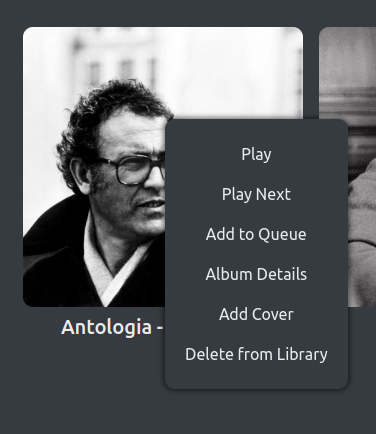
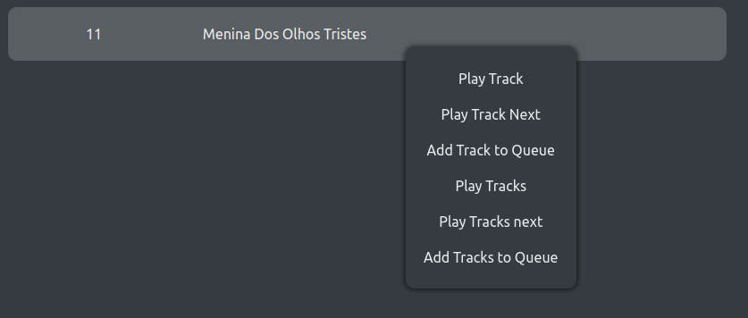
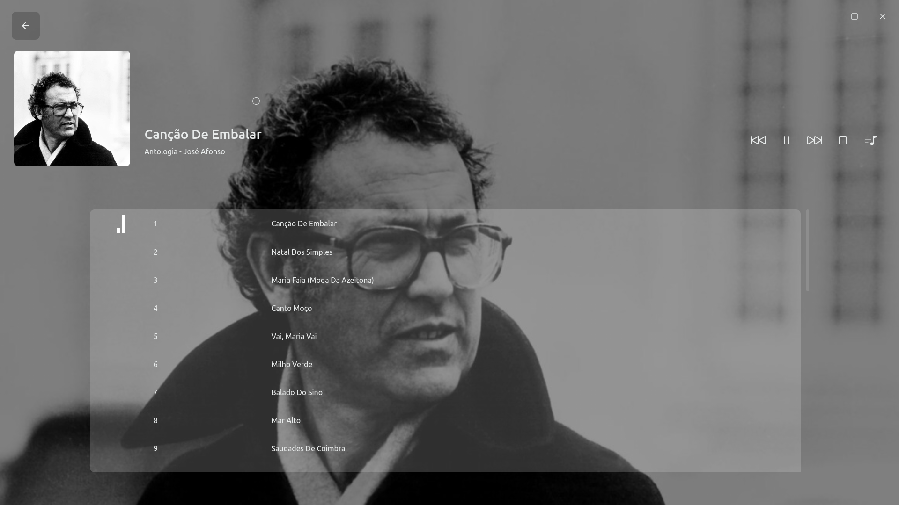

# User documentation
{:.no_toc}

This is the user documentation of Musicly. It provides a complete explanation of how Musicly works and teaches how to deal with all its features. If you just want a quick introduction, take a look at Musicly's tutorial (`Settings > Tutorial`).

## Table of contents
{:.no_toc}

* TOC
{:toc}

## Navigating

Navigation in the app is done mainly trough the control button. You have to hover Musicly's logo to unveil it. Quite obviously, the cog will take you to the settings and the plus sign allows you to add music to your library.


When you are not in the main page, this button will be replaced by a single back arrow that will take you to the Library view.

A couple navigation shortcuts are set up: `ctrl+s` or `s` for settings, `ctrl+o` or `o` for adding music and `escape` or `alt+arrowleft` for going back.

## Searching

If you ever get lost in your huge library :), you can use the search box. Besides allowing to search for album title, track title, artist and composer, genres are suggested as you type. Click on them to further filter your albums.


The shortcut for searching is `ctrl+f`.

## Albums

Hovering an album cover will show buttons that allow to play and view details. Furthermore, right clicking on it will bring up a context menu with a handful of useful actions.



## Tracks

The music tracks look like the one bellow. You may click on them to play or right click to bring up a context menu.



## Control Area

You control the music playback in this area. You can pause, play, stop, skip, view the queue and seek the currently playing track. Furthermore, clicking on the album cover or on the track info will take you to the queue.


The shortcuts defined here are: `space` for pausing and playing, `arrowleft` for seeking backward, `arrowright` for seeking forward and `ctrl+q` or `q` for accessing the queue. Your keyboard's media keys will also work with the control area.

## Queue

To view the tracks coming next, head to the queue (`ctrl+q`, `q` or the music list button in the control area). If you make no movement for three seconds, the queue will hide and only the background and track info remains.




## Album Details

To know which tracks make up an album, its genres, composers and artists, click on the list icon in an album (the three horizontal streaks). You will obtain something like the image bellow:


## Settings

In the settings, you can change you color theme and the zoom of the app. You can also reset your library and settings and view the initial tutorial again.


## Custom Styling

You can add your custom styles to the app, using CSS. Although this might seem complicated, stick around: I will give you code snippets. Advanced users that want to go beyond the examples given can use the console to inspect the different elements and selectors (`ctrl+shift+i`).

### File location

You custom CSS should be placed in a file called `custom.css`. This should in turn be at `[userData]/css/custom.css`. `userData` depends on the OS: `~/.config/musicly` on Linux, `~/Library/Application Support/musicly` on macOS and `%APPDATA%/musicly` on Windows.

### Examples

#### Background color

```css
#app.theme-light, #app.theme-dark {
    /* keywords, rgb and hex are supported */
    --bg-color: red;
    --bg-color: rgb(255, 0, 0);
    --bg-color: #ff0000;
    
    /* It is best to change non-opace background colors too,
    used in other app parts */
    --bg-color-05: rgba(255, 0, 0, 0.5);
    --bg-color-02: rgba(255, 0, 0, 0.5);
}
```

#### Text color

```css
#app.theme-light, #app.theme-dark {
    --color: red;
    --color-05: rgba(255, 0, 0, 0.5);
    --color-02: rgba(255, 0, 0, 0.2);
}
```

#### Border radius

Border radius sets how round the app's elements will be.

```css
#app.theme-light, #app.theme-dark {
    /* Default value */
    --border-radius: 10px;
    /* This will cause all elements to be round */
    --border-radius: 50%;
}
```

#### Button hover color

```css
#app.theme-light, #app.theme-dark {
    --button-hover-bg: rgb(255, 255, 255);
}
```

#### Complete example

The following code implements a (rather horrible!) monochrome theme - image bellow.

```css
#app.theme-light, #app.theme-dark {
    --bg-color: black;
    --bg-color-05: rgba(0, 0, 0, 0.5);
    --bg-color-02: rgba(0, 0, 0, 0.2);

    --color: rgb(33, 180, 33);
    --color-05: rgba(33, 180, 33, 0.5);
    --color-02: rgba(33, 180, 33, 0.2);

    --border-radius: 5px;

    --button-hover-bg-color: rgba(33, 180, 33, 0.2);
}

.cover {
    /* Turn all images green */
    filter: grayscale(100%) brightness(80%) sepia(300%) hue-rotate(50deg) saturate(200%);
}
```


## Issues & Bugs

If you find an error with the app or with this web page, you can file an issue [here](https://github.com/m7kra/Musicly/issues) or send an email to `inboxaljezur@gmail.com`. I'll be glad to adress it!