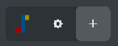
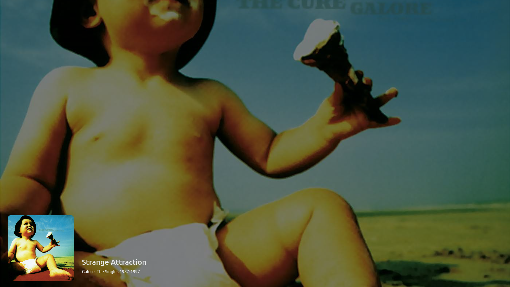
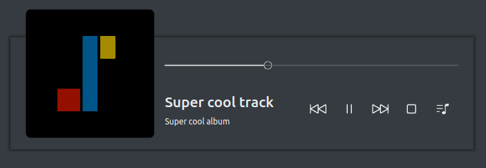
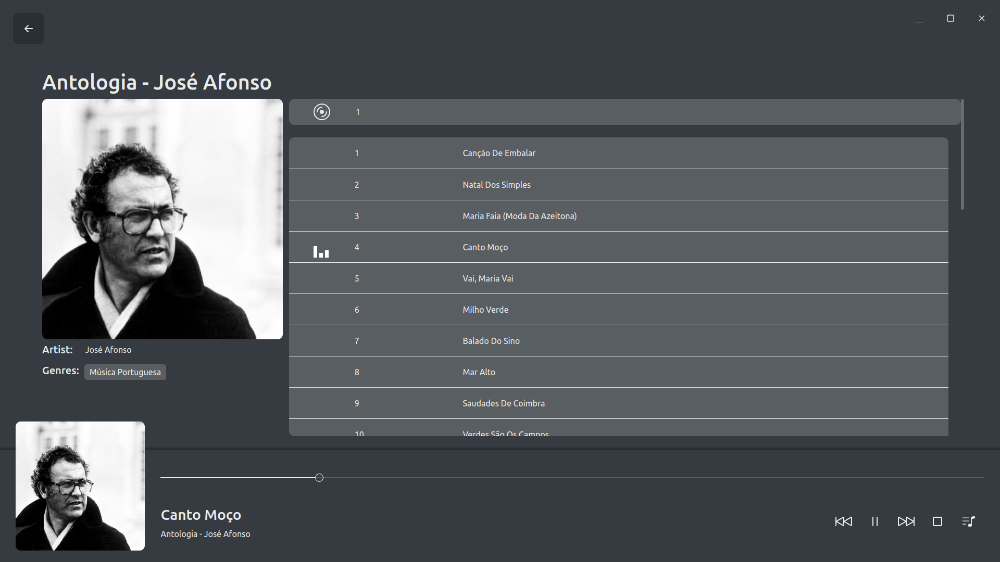
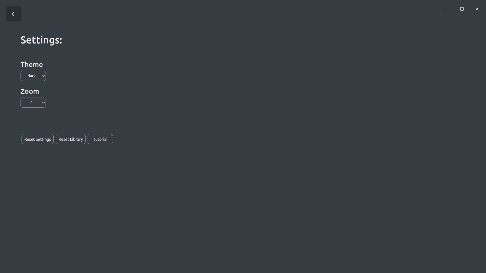
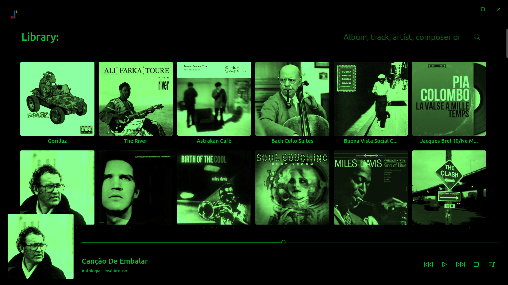

# User documentation
{:.no_toc}

This is the user documentation of Musicly. Its aim is to provide a comprehensive explanation of how Musicly works. If you just want a quick introduction, take a look at Musicly's tutorial (`Settings > Tutorial`).

## Table of contents
{:.no_toc}

* TOC
{:toc}

## The basics

### Navigating

Navigation in the app is done mainly trough the control button. You have to hover Musicly's logo to unveil it. Quite obviously, the cog will take you to the settings and the plus sign allows you to add music to your library.



A couple navigation shortcuts are set up: `ctrl+s` or `s` for settings, `ctrl+o` or `o` for adding music, `escape` or `alt+arrowleft` for going back and `ctrl+m` or `m` for mini-player mode.

### The Queue

The queue is where the songs are stored. You can access it through the music note button on the bottom right corner of the app. Once you are there, you can reorder tracks and delete them from the queue.

Throughout the app, you will probably find the options to `Play`, `Add next` and `Add to queue`.

- `Play`: The queue is substituted by the new tracks.
- `Play next`: The new tracks are added to the queue after the current one.
- `Add to queue`: The new tracks are added to the end of the queue.

If you make no movement for 6 seconds, the queue will hide itself.




### Searching

If you ever get lost in your huge library :), you can use the search box. Besides allowing to search for album title, track, artist and composer, genres are suggested as you type. Click on them to display only the albums that match the genre.


The shortcut for searching is `ctrl+f`.

### Mini-player mode

Clicking on the minimize window will reduce Musicly to a small window, which will stay always on top. This behavior can be changed at any time in the settings. You can also change its size.


### Control Area

You control the music playback in this area. You can pause, play, stop, skip, view the queue and seek (go 5 seconds forward or backward) the currently playing track.



The shortcuts defined here are: `space` for pausing and playing, `arrowleft` for seeking backward, `arrowright` for seeking forward and `ctrl+q` or `q` for accessing the queue. Your keyboard's media control keys will also work with the control area.

### Album Details

To know more about an album, click the list button on the cover. You can edit the album's metadata and tracks.



### Settings

In the settings, you can change you color theme, the zoom of the app and custom styling (more on styling bellow). You can also reset your library and settings and view the initial tutorial again.



## Custom Styling

You can add your custom styles to the app, using CSS. Advanced users may use the console to inspect the different elements and selectors (`ctrl+shift+i`).

While styling your app, please remember to set the `theme` setting to whathever fits your styles best, because some components rely on theme information different than the stylesheet.

### Examples

#### Background color

```css
#app.theme-light, #app.theme-dark {
    /* keywords, rgb and hex are supported */
    --bg-color: red;
    --bg-color: rgb(255, 0, 0);
    --bg-color: #ff0000;

    /* It is best to change non-opace background colors too,
    used in other app parts */
    --bg-color-05: rgba(255, 0, 0, 0.5);
    --bg-color-02: rgba(255, 0, 0, 0.5);
}
```

#### Text color

```css
#app.theme-light, #app.theme-dark {
    --color: red;
    --color-08: rgba(255, 0, 0, 0.8);
    --color-05: rgba(255, 0, 0, 0.5);
    --color-02: rgba(255, 0, 0, 0.2);
}
```

#### Search box border

In the original version of Musicly, the search box had no border. I later realized that this would not help new app users, and therefore put it back. However, I still think that it looks better without border. You can achieve that with the following code:

```css
#search-container {
    border: none;
}
#search-container:hover {
    border: none;
}
```

#### Border radius

Border radius sets how round the app's elements will be.

```css
#app.theme-light, #app.theme-dark {
    /* Default value */
    --border-radius: 10px;
    /* This will cause all elements to be round */
    --border-radius: 50%;
}
```

#### Button hover color

```css
#app.theme-light, #app.theme-dark {
    --button-hover-bg: rgb(255, 255, 255);
}
```

#### Complete example

The following code implements a (rather horrible!) monochrome theme - image bellow.

```css
#app.theme-light, #app.theme-dark {
    --bg-color: black;
    --bg-color-05: rgba(0, 0, 0, 0.5);
    --bg-color-02: rgba(0, 0, 0, 0.2);

    --color: rgb(33, 180, 33);
    --color-08: rgba(33, 180, 33, 0.8);
    --color-05: rgba(33, 180, 33, 0.5);
    --color-02: rgba(33, 180, 33, 0.2);

    --border-radius: 5px;

    --button-hover-bg-color: rgba(33, 180, 33, 0.2);
}

.cover, #queue {
    /* Turn all images green */
    filter: grayscale(100%) brightness(80%) sepia(300%) hue-rotate(50deg) saturate(200%);
}
```



## Issues & Bugs

If you find an error with the app or with this web page, you can file an issue [here](https://github.com/m7kra/Musicly/issues) or send an email to `inboxaljezur@gmail.com`. I'll be glad to adress it!
